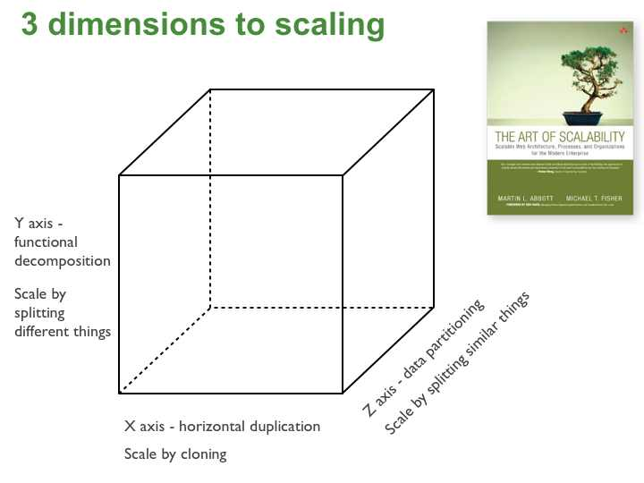

### What's wrong with the classic monolith?

* Developers can't confidently make changes to the application because it is far too intimidating
* Scaling the application can be a challenge (*e.g.* different infrastructure needs for different parts of the application -> the hardware is not easy to find). Scaling a component means scaling *all* components, not only those under heavy load.
* Long-term commitment to a particular technology stack.

### Microservices

> Taken from http://microservices.io/articles/scalecube.html

#### What options are there for *developing* microservices?

* Spring Boot
* Scalatra
* Dropwizard
* NodeJS

#### What options are there for *deploying* microservices?

**+ isolation / manageability - density/efficiency**

* VM / Physical Machines
* Docker
* JVM /Process
* JAR / WAR / OSGI Bundles

**- isolation / manageability + density/efficiency**

#### Microservice partition Strategies

* By noun: *e.g.* **Product info service**
* By verb: *e.g.* **Checkout service**
* By DDD subdomain
* Always do the partition with the Single-reponsibility principle in mind
* Package together things that change at the same time and for the same reasons
* Take UNIX utilities as an example (do one thing right)
* The smallest *atomic* unit of service that delivers business value.

> **Goal:** Most changes affect only one service

#### Drawbacks

* Increased complexity
* Multiple database management
* Testing a distributed system is not trivial
* Deployment strategies must be designed with care
* Development/deployment needs to be carefully coordinated

#### Migrating from the monolith

* Don't do a Big Bang, the only thing you're guaranteed to get is a **Big bang**. (Fowler, I think)
* Apply the Strangler pattern (develop around the older functionalities until they **die**)
* Develop new functionalities as microservices -> **stop digging the hole!**
* Incrementally migrate your old code into services.

### References
* [The Art of Scalability - Abbott, Fischer](http://www.amazon.com/The-Art-Scalability-Architecture-Organizations/dp/0137030428)
* [microservices.io](http://microservices.io)
